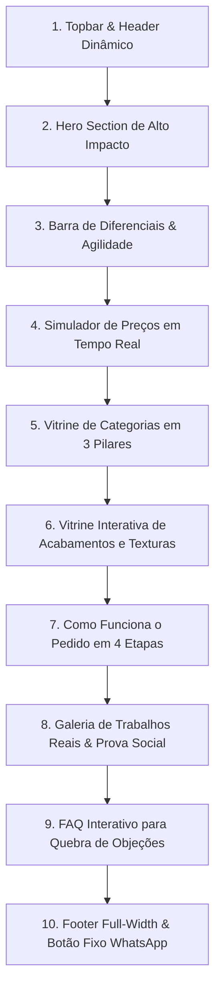

# Esqueleto da Página Principal (HOME) — VM Gráfica

## 1. Visão Geral do Produto & Posicionamento
* **Tipo:** Landing Page de Alta Conversão + Vitrine de E-commerce Híbrida.
* **Foco:** Gráfica Rápida e Personalizados (B2B Corporativo, Comércio Local, Eventos e Brindes).
* **Diretriz Visual:** Layout *Edge-to-Edge* (Full-Width), fundos degradê profundos (*Mesh/Craft Gradients*), tipografia moderna e cards com texturas realistas dos acabamentos.
* **Ação Primária (CTA):** Direcionamento direto para pedido/fechamento via WhatsApp com pedido pré-estruturado.
* **Alinhamento de Conteúdo:** Foco estrito em produtos impressos e personalizados (serviços de presença digital/Google Meu Negócio foram despriorizados da Home).

---

## 2. Design System & Identidade Visual (Dark Mode Premium)
* **Background Principal:** `#0B0F17` (Dark Obsidian Profundo) com camadas de iluminação em `#111827` e `#1E293B`.
* **Acentos & Gradientes CMYK High-Tech:**
  * **Cyan Elétrico:** `#00F0FF` / `#06B6D4` (representando precisão digital, tecnologia e agilidade).
  * **Magenta / Neon Purple:** `#EC4899` / `#A855F7` (representando criatividade e acabamentos nobres).
* **Superfícies & Cards:** *Glassmorphism* com `backdrop-blur-md`, fundo `rgba(255, 255, 255, 0.03)` e bordas sutis `rgba(255, 255, 255, 0.08)`.
* **Tipografia:** Fonte limpa, geométrica e moderna (ex: *Outfit* ou *Inter* para títulos com tracking ajustado).

---

## 3. Mapa Detalhado das 10 Seções da HOME (Full-Width)

### Seção 1: Topbar de Confiança & Header Dinâmico (Full-Width)
* **Topbar:** Mensagem de urgência/confiança: *"⚡ Produção Rápida | 🎨 Criação de Arte Profissional | 📦 Entregas para toda a Região"*.
* **Navbar:**
  * Logo VM Gráfica (moderno, com acabamento brilhante/vetorial).
  * Menu: `Produtos & Categorias`, `Simulador de Preços`, `Acabamentos Especiais`, `Como Pedir`, `Dúvidas`.
  * Botão de Destaque: `Pedir pelo WhatsApp` (com ícone pulsante).

### Seção 2: Hero Section de Alto Impacto (Full-Width)
* **Headline:** *"Sua Marca com Acabamento Profissional e a Velocidade que Seu Negócio Precisa."*
* **Sub-headline:** *"De cartões corporativos de alta gramatura a copos e brindes em DTF UV com relevo premium. Simule seu orçamento agora ou fale direto com nossa equipe."*
* **Botões de Ação (CTA Duplo):**
  1. **Primário:** `⚡ Simular Preço Online` (scroll suave para a calculadora).
  2. **Secundário:** `💬 Falar no WhatsApp` (abre conversa direta com atendente).
* **Elemento Visual (Hero Showcase):** Composição visual edge-to-edge com renderizações/fotos em alta definição destacando reflexos de verniz, relevo tátil em DTF UV e texturas de papéis especiais.

### Seção 3: Barra de Diferenciais & Prova de Valor (Full-Width Strip)
* 4 pilares visuais com ícones minimalistas e micro-animações:
  1. **🎨 Criamos sua Arte:** Não tem o arquivo pronto? Nossa equipe desenha do zero.
  2. **💎 Acabamento Superior:** Verniz localizado, laminação fosca e relevo DTF UV durável.
  3. **⚡ Agilidade Real:** Prazos expressos para materiais corporativos e eventos.
  4. **📦 Atendimento Personalizado:** Suporte direto no WhatsApp do envio da arte até a entrega.

### Seção 4: Simulador de Orçamento em Tempo Real (Calculadora Interativa)
* **Estrutura Passo a Passo Integrada na Home:**
  * **Passo 1:** Seleção do Produto Base (ex: Cartão de Visita, Copo Acrílico, Panfleto, Bloco de Pedido, Adesivo).
  * **Passo 2:** Escolha do Material / Gramatura (ex: Couchê 300g, Couchê 250g, Papel Kraft, Acrílico).
  * **Passo 3:** Tipo de Acabamento (ex: Verniz Localizado, Laminação Fosca, Impressão DTF UV Relevo, Sem Verniz).
  * **Passo 4:** Quantidade Desejada (seletor dinâmico: 100, 250, 500, 1000 unidades ou quantidade livre).
* **Card de Resumo Instantâneo:**
  * Exibe: Subtotal, Economia por volume, Prazo estimado de produção.
  * **CTA:** Botão destacado *"Pedir Agora no WhatsApp com esta Configuração"*, que abre o WhatsApp já preenchendo a mensagem do pedido formatada.

### Seção 5: Vitrine de Produtos & Categorias (3 Grandes Pilares)
* **Pilar 1 — Linha Corporativa & Comercial:**
  * Cartões de Visita (Couchê 250g/300g, Verniz Total, Verniz Localizado).
  * Panfletos e Flyers (90g, 115g, 150g).
  * Blocos de Pedidos, Recibos e Comandas personalizadas (50x2 ou 50x3 vias).
  * Adesivos Vinil & Papel (para embalagens, delivery e produtos).
  * Tags e Rótulos com furo/corte especial.
* **Pilar 2 — Eventos, Festas & Brindes Premium:**
  * Copos Long Drink, Twister e Taças com **DTF UV** (relevo táctil de alta fixação).
  * Canecas de Cerâmica personalizadas (Sublimação fotográfica).
  * Topos de Bolo 3D em camadas de papel especial.
  * Chaveiros acrílicos/mdf e brindes corporativos.
  * Camisetas e Sacolas em algodão cru / poliéster personalizadas.
* **Pilar 3 — Serviços Rápidos & Balcão:**
  * Fotos Polaroid personalizadas (com ou sem ímã).
  * Fotos 3x4 instantâneas.
  * Plastificação de documentos até tamanho A3.
  * Placas de PIX e QR Code em acrílico para balcão de lojas.

### Seção 6: Vitrine Interativa de Acabamentos & Tecnologias
* **Demonstração Visual e Benefícios:**
  1. **DTF UV em Alto Relevo:** Impressão direta com textura tridimensional, resistente a água, atrito e lavagens em copos e rígidos.
  2. **Verniz Localizado com Laminação Fosca (Bopp):** O toque aveludado do fundo fosco contrastando com o brilho espelhado no logotipo.
  3. **Papéis Especiais e Gramaturas Nobres (300g+):** Rigidez que transmite seriedade e autoridade à marca do cliente.
  4. **Sublimação de Alta Fidelidade:** Cores vivas e permanentes para tecidos e cerâmicas.

### Seção 7: Como Funciona o Pedido (Timeline de 4 Etapas)
1. **1. Escolha ou Simule:** Selecione os produtos e quantidades pelo site ou fale conosco.
2. **2. Envio ou Criação de Arte:** Envie seu arquivo (PDF, CDR, PNG) ou conte com nossos designers.
3. **3. Aprovação Digital com Garantia:** Geramos uma prévia visual exata. A produção só inicia após o seu "OK".
4. **4. Impressão & Entrega Ágil:** Produção expressa com opção de retirada no balcão ou entrega rápida.

### Seção 8: Galeria de Trabalhos Reais & Prova Social
* Feed estilo mosaico com fotos de produtos reais finalizados (copos brilhando, cartões com relevo, blocos montados).
* Avaliações reais de clientes destacando prazo, qualidade de impressão e facilidade no WhatsApp.

### Seção 9: FAQ Estruturado (Resolução de Objeções)
* *"Não tenho a arte pronta, vocês fazem?"* (Sim, criamos e enviamos a prévia para aprovação).
* *"Qual a quantidade mínima para pedidos?"* (Temos tiragens reduzidas para balcão e grandes lotes com desconto).
* *"O que é DTF UV e qual a durabilidade em copos?"* (Tecnologia que não desbota, não descasca e aceita lavagem).
* *"Como funciona a entrega e prazos?"* (Detalhes de prazos por categoria e opções de envio).

### Seção 10: Footer Full-Width & Botão Flutuante do WhatsApp
* Mapa/Endereço do balcão de atendimento, horários, canais de contato e links rápidos.
* Botão flutuante persistente do WhatsApp com tooltip inteligente (*"Dúvida rápida? Fale direto com a produção"*).
